---
## ID：P-2026-01-1.1-001
**知识点**：#地球自转,#物理模型的构建
**难度**：0.4
**题型**：单选题
**题目描述**：太阳从东边升起，西边落下，是地球上的自然现象，但在某些条件下，在纬度较高地区上空飞行的飞机上，旅客可以看到太阳从西边升起的奇妙现象，这些条件是
**选项**：
 A. 时间必须是在清晨，飞机正在由东向西飞行，飞机的速度必须较大
 B. 时间必须是在清晨，飞机正在由西向东飞行，飞机的速度必须较大
 C. 时间必须是在傍晚，飞机正在由东向西飞行，飞机的速度必须较大
 D. 时间必须是在傍晚，飞机正在由西向东飞行，飞机的速度不能太大
**答案**：C
**解析**：如果是在傍晚，飞机正在由东向西飞行，飞机的速度大于当地纬度较高地区地球自转的线速度，则地球表面的人看到太阳从西方落下来，飞机上的旅客可以看到太阳从西边升起，如图所示

---
## ID：P-2026-01-1.1-002
**知识点**：#质点模型,#参考系
**难度**：0.9
**题型**：单选题
**题目描述**：2015年9月3日，纪念中国人民抗日战争暨世界反法西斯战争胜利70周年阅兵式在天安门广场举行.如图所示，七架战机保持“固定队列”在天安门广场上空飞过.下列说法正确的是

**选项**：
 A. 以某飞机为参考系，其他飞机是静止的
 B. 以飞行员为参考系，广场上的观众是静止的
 C. 以某飞行员为参考系，其他飞行员是运动的
 D. 以广场上的观众为参考系，飞机是竖直向上运动的
**答案**：A
**解析**：七架战机保持“固定队列”飞行，所以以某飞机为参考系，其它飞机是静止的，故A正确；以飞行员为参考系，飞行员看到观礼台向后掠过，故B错误；六机低空拉烟通场表演，以非常一致的飞行姿态通过观礼台，飞机编队保持队形不变，所以以某飞行员为参考系，其他飞行员是静止的，故C错误；以广场上的观众为参考系，飞机是在水平方向上运动的，故D错误.

---
## ID：P-2026-01-1.1-003
**知识点**：#参考系
**难度**：0.9
**题型**：单选题
**题目描述**：如图所示，新中国成立70周年阅兵仪式上，国产武装直升机排列并保持“70”字样编队从天安门上空整齐飞过.甲、乙分别是编队中的两架直升机，则

**选项**：
A. 以甲为参考系，乙是运动的
B. 以乙为参考系，甲是运动的
C. 以甲为参考系，坐在观众席上的观众都是静止的
D. 以乙为参考系，“70”字样编队中所有直升机都是静止的
**答案**：D
**解析**：直升机编队保持“70”字样飞行，则以甲为参考系，甲、乙间没有位置的改变，故乙是相对静止的，同理以乙为参考系，甲是静止的，故AB错误；以甲为参考系，坐在观众席上的观众都是运动的，故C错误；以乙为参考系，“70”字样编队中所有直升机都是静止的，故D正确.

---
## ID：P-2026-01-1.1-004
**知识点**：#质点
**难度**：0.9
**题型**：单选题
**题目描述**：2020年11月10日，我国“奋斗者”号载人潜水器在马里亚纳海沟成功坐底，坐底深度10909m.“奋斗者”号照片如图所示，下列情况中“奋斗者”号一定可视为质点的是

**选项**：
A. 估算下降总时间时
B. 用推进器使其转弯时
C. 在海沟中穿越窄缝时
D. 科学家在其舱内进行实验时
**答案**：A
**解析**：估算“奋斗者”号下降总时间时，其大小、形状可以忽略不计，可视为质点，故A正确；用推进器使其转弯时、在海沟中穿越窄缝时、科学家在其舱内进行实验时，其大小、形状不能忽略，故不可视为质点，故BCD错误.

---
## ID：P-2026-01-1.1-005
**知识点**：#质点
**难度**：0.9
**题型**：单选题
**题目描述**：用高速摄影机拍摄的四张照片如图所示，下列说法正确的是

**选项**：
A. 研究甲图中猫在地板上行走的速度时，猫可视为质点
B. 研究乙图中水珠形状形成的原因时，旋转球可视为质点
C. 研究丙图中飞翔鸟儿能否停在树桩上时，鸟儿可视为质点
D. 研究丁图中马术运动员和马能否跨越障碍物时，马可视为质点
**答案**：A
**解析**：研究猫在地板上行走的速度时，猫的大小与形状可以忽略，所以猫可以看作质点，故A正确；研究水珠形状形成的原因时，旋转球的大小与形状不能忽略，所以旋转球不能看作质点，故B错误；研究飞翔的鸟儿能否停在树桩上时，鸟儿的大小和形状不能忽略，所以飞翔的鸟儿不能看作质点，故C错误；研究马术运动员和马能否跨越障碍物时，要考虑动作细节，马的大小与形状不能忽略，所以马不能看作质点，故D错误.

---
## ID：P-2026-01-1.1-006
**知识点**：#质点
**难度**：0.9
**题型**：单选题
**题目描述**：
**选项**：
 A. 研究甲图中排球运动员扣球动作时，排球可以看成质点
 B. 研究乙图中乒乓球运动员的发球技术时，乒乓球不能看成质点
 C. 研究丙图中羽毛球运动员回击羽毛球动作时，羽毛球大小可以忽略
 D. 研究丁图中体操运动员的平衡木动作时，运动员身体各部分的速度可视为相同
**答案**：B
**解析**：研究题图甲中排球运动员扣球动作时,需要考虑运动员扣球的位置,故排球不可以看成质点,故A错误;研究题图乙中乒乓球运动员的发球技术时,需要考虑球是否旋转,则乒乓球不能看成质点,故B正确;研究题图丙中羽毛球运动员回击羽毛球动作时,需要考虑球拍击球的具体位置,则羽毛球大小不可以忽略,故C错误;研究题图丁中体操运动员的平衡木动作时,运动员身体各部分有相对运动,则运动员身体各部分的速度不相同,故D错误.

---
## ID：P-2026-01-1.1-007
**知识点**：#质点
**难度**：0.9
**题型**：单选题
**题目描述**：杭州亚运会顺利举行,如图所示为运动会中的四个比赛场景.在下列研究中可将运动员视为质点的是

**选项**：
A. 研究甲图运动员的入水动作
B. 研究乙图运动员的空中转体姿态
C. 研究丙图运动员在百米比赛中的平均速度
D. 研究丁图运动员通过某个攀岩支点的动作
**答案**：C
**解析**：质点是理想模型,现实中不存在,当研究对象的形状和大小对研究问题不影响或影响很小可忽略时,在该研究问题中的研究对象可被看成质点,故C正确,ABD错误.

---
## ID：P-2026-01-1.1-008
**知识点**：#质点
**难度**：0.9
**题型**：单选题
**题目描述**：
“神舟十五号”飞船和空间站“天和”核心舱成功对接后，在轨运行如图所示，则
**选项**：
A. 选地球为参考系，“天和”是静止的
B. 选地球为参考系，“神舟十五号”是静止的
C. 选“天和”为参考系，“神舟十五号”是静止的
D. 选“神舟十五号”为参考系，“天和”是运动的
**答案**：C
**解析**："神舟十五号"飞船和空间站"天和"核心舱对接后环绕地球做匀速圆周运动，因此以地球为参考系，"神舟十五号"和"天和"均是运动的，AB错误;选"天和"为参考系，"神舟十五号"是静止的，C正确;选"神舟十五号"为参考系，"天和"是静止的，D错误.

---
## ID：P-2026-01-1.1-009
**知识点**：#路程,#位移,#时间,#时刻
**难度**：0.9
**题型**：单选题
**题目描述**：(2016·浙江4月·1)某同学绕操场一周跑了400m，用时65s。这两个物理量分别是
**选项**：
A. 路程、时刻
B. 位移、时刻
C. 路程、时间
D. 位移、时间
**答案**：C
**解析**：绕400米操场跑一圈，首末位置重合，则位移的大小为0，路程等于400m。65s指时间长度，是指时间，故C正确。

---
## ID：P-2026-01-1.1-010
**知识点**：#速度,#速率,#位移,#路程
**难度**：0.9
**题型**：单选题
**题目描述**：(2018·浙江4月·2)某驾驶员使用定速巡航，在高速公路上以时速110公里行驶了200公里。其中"时速110公里""行驶200公里"分别是指
**选项**：
A. 速度、位移
B. 速度、路程
C. 速率、位移
D. 速率、路程
**答案**：D
**解析**："时速110公里"是指汽车的速度大小，即速率；"行驶200公里"指汽车运动轨迹的长度，是路程，D正确。

---
## ID：P-2026-01-1.1-011
**知识点**：#速度,#路程,#时间
**难度**：0.9
**题型**：单选题
**题目描述**：(2017·浙江4月·5)四月的江南草长莺飞，桃红柳绿，雨水连绵。伴随温柔的雨势，时常出现瓢泼大雨，雷电交加的景象。在某次闪电过后约2s小明听到雷声，则雷电生成处距离小明的距离约为
**选项**：
A. $$6 \times 10^{2}$$ m
B. $$6 \times 10^{4}$$ m
C. $$6 \times 10^{6}$$ m
D. $$6 \times 10^{8}$$ m
**答案**：A
**解析**：声速大约为 $$340 \, \mathrm{m/s}$$，所以雷电生成处距离小明的距离约为 $$340 \, \mathrm{m/s} \times 2 \, \mathrm{s} = 680 \, \mathrm{m}$$，故A正确。

---
## ID：P-2026-01-1.1-012
**知识点**：#速度,#光速,#声速,#误差分析
**难度**：0.7
**题型**：单选题
**题目描述**：(2005·北京·19)一看到闪电12.3s后又听到雷声，已知空气中的声速为330～340m/s，光速为 $$3 \times 10^{8}$$ m/s，于是他用12.3除以3得到从发出闪电发生位置到他的距离为4.1km.根据所掌握的物理知识可以判断( )
**选项**：
A. 这种估算方法是错误的，不可采用
B. 这种估算方法可以以比较准确估算出闪电发生位置与观察者的距离
C. 这种估算方法没有考虑光的传播时间，结果误差太大
D. 即使声速增大2倍以上，本题的估算仍然有效
**答案**：B
**解析**：考虑光的传播时间 $$t_0$$，解答如下：$$s = ct_0$$，$$s = v(t_0 + t)$$，解得 $$s = \frac{vct}{c-v}$$。若不考虑光的传播时间，则闪电发生位置到观察者间距离为 $$s' = vt$$，则两次计算的相对误差差 $$\frac{s-s'}{s} = \frac{v}{c}$$。因 $$v \ll c$$，故光传播时间对结果影响很小，故B正确。

---
## ID：P-2026-01-1.1-013
**知识点**：#位移,#参考系
**难度**：0.8
**题型**：单选题
**题目描述**：(2017·浙江11月·4)如图所示，两位同学从滑道最高端的同一位置先后滑下，到达滑道端的同一位置，对于整个下滑过程，两同学的

**选项**：
A. 位移一定相同
B. 时间一定相同
C. 末速度一定相同
D. 平均速度一定相同
**答案**：A
**解析**：两位同学从同一位置下滑，末位置相同，故位移相同，故A正确；两位同学掌握度不一定相同，故时间不一定相同，故B错误；虽然位置上的变化相同，但路径不同，平均速度不一定相同，故C错误；平均速度不一定相同，故BCD错误。

---
## ID：P-2026-01-1.1-014
**知识点**：#加速度,#位移,#轨迹长度
**难度**：0.7
**题型**：单选题
**题目描述**：(2023·浙江6月·4)图为"玉兔二号"巡视器在月球上从O点行走到B点的照片，OA段为直线，AB段是曲线，巡视器质量为135 kg，则巡视器
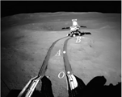
**选项**：
A. 受到月球的引力为1 350N
B. 在AB段运动时一定有加速度
C. OA段与AB段的平均速度方向相同
D. 从O到B的位移大小等于OAB轨迹长度
**答案**：B
**解析**：由于月球表面的重力加速度是地球表面重力加速度的 $$\frac{1}{6}$$，则巡视器受到月球的引力约为 $$\frac{1}{6} \times 1350$$ N $$= 225$$ N，A错误。因为AB段的速度方向改变，即其加速度一定不等于零，B正确。OA段为直线，AB段为曲线，则OA段的平均速度的方向与AB段的平均速度的方向一定不相同，C错误。从O到B的位移大小一定小于OAB轨迹长度，D错误。

---
## ID：P-2026-01-1.1-015
**知识点**：#位移,#路程,#平均速度,#平均速率
**难度**：0.5
**题型**：单选题
**题目描述**：(2021·福建·1)游客在武夷山九曲溪乘竹筏漂流，途经双乳峰附近的M点和玉女峰附近的N点，如图所示。已知游客从M点漂流到N点的路程为5.4km，用时1h，M、N间的直线距离为1.8km，则从M点漂流到N点的过程中
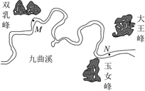
**选项**：
A. 游客的位移大小为5.4km
B. 游客的平均速率为5.4m/s
C. 游客的平均速度大小为0.5m/s
D. 若以所乘竹筏为参考系，玉女峰的平均速度为0
**答案**：C
**解析**：位移指的是从M点漂流到N点的有向线段，故位移大小为1.8km，故A错误；游客的平均速率为路程与时间的比值，$$\bar{v} = \frac{s}{t} = \frac{5.4}{1} \, \text{km/h} = 1.5 \, \text{m/s}$$，故B错误；游客的平均速度大小为位移与时间的比值，$$\bar{v} = \frac{x}{t} = \frac{1.8}{1} \, \text{km/h} = 0.5 \, \text{m/s}$$，故C正确；若以所乘竹筏为参考系，玉女峰的平均速度为0.5m/s，故D错误。

---
## ID：P-2026-01-1.1-016
**知识点**：#位移,#路程,#平均速度,#平均速率
**难度**：0.6
**题型**：单选题
**题目描述**：(2023·福建·1)"祝融号"火星车沿如图所示路线行驶，在此过程中揭秘了火星乌托邦平原浅表分层结构。该研究成果被列为"2022年度中国科学十大进展"之首。"祝融号"从着陆点O处出发，经过61天到达M处，行驶路程为585米；又经过23天，到达N处，行驶路程为304米。已知O、M和M、N间的直线距离分别约为463米和234米，则火星车
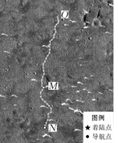
**选项**：
A. 从O处行驶到N处的路程为697米
B. 从O处行驶到N处的位移大小为889米
C. 从O处行驶到M处的平均速率约为20米/天
D. 从M处行驶到N处的平均速度大小约为10米/天
**答案**：D
**解析**：由题意可知从O处到N处的路程为 $$s_{ON} = s_{OM} + s_{MN} = 585 \, \text{m} + 304 \, \text{m} = 889 \, \text{m}$$，选项A错误；位移的大小为两点之间的直线距离，由题图可知O、M、N不在一条直线上，故O、N间位移小于889米，选项B错误；平均速率为路程与时间的比值，故从O处行驶到M处的平均速率为 $$\bar{v}_{OM} = \frac{s_{OM}}{t_{OM}} = \frac{585}{61} \approx 9.6 \, \text{米/天}$$，选项C错误；平均速度大小为位移与时间的比值，则从M处行驶到N处的平均速度为 $$\bar{v}_{MN} = \frac{x_{MN}}{t_{MN}} = \frac{234}{23} \approx 10 \, \text{米/天}$$，选项D正确。

---
## ID：P-2026-01-1.1-017
**知识点**：#位移,#相对运动,#参考系
**难度**：0.5
**题型**：单选题
**题目描述**：(2022·辽宁)如图所示，塔式起重机主要由可移动"桥架""小车"和固定"轨道"三部分组成。在某次作业中，桥架沿轨道单向移动了8m，小车在桥架上单向移动了6m，该次作业中小车相对地面的位移大小为（　　）
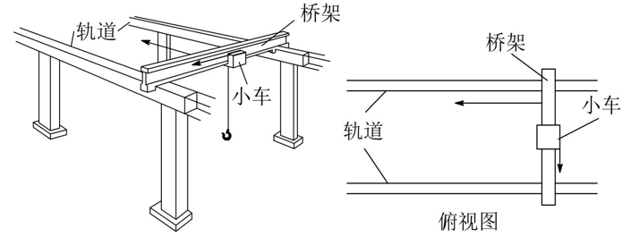
**选项**：
A. 6m
B. 8m
C. 10m
D. 14m
**答案**：C
**解析**：如图所示，以地面为参考系，则在该次作业中小车相对地面的位移大小为 $$\sqrt{6^2 + 8^2} \, \text{m} = 10 \, \text{m}$$，故C正确。

---
## ID：P-2026-01-1.1-018
**知识点**：#速度,#路程,#时间
**难度**：0.4
**题型**：单选题
**题目描述**：(2015·浙江10月·4)小李乘坐高铁，当他所在的车厢刚要进隧道时，看到车厢内显示屏上的示数为216km/h，他立即观察手表秒针走动，经过20s车厢出了隧道，则该隧道的长度约为（　　）
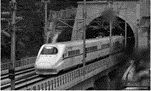
**选项**：
A. 600m
B. 1200m
C. 2160m
D. 4320m
**答案**：B
**解析**：$$x=vt=\frac{216}{3.6}\times 20\text{m}=1200\text{m}$$，故B正确。

---
## ID：P-2026-01-1.1-019
**知识点**：#匀变速直线运动,#加速度,#位移
**难度**：0.4
**题型**：单选题
**题目描述**：(2022·全国甲·15)长为 $$l$$ 的高速列车在平直轨道上正常行驶，速率为 $$v_0$$，要通过前方一长为 $$L$$ 的隧道，当列车的任一部分处于隧道内时，列车速率都不允许超过 $$v$$（$$v < v_0$$）。已知列车加速和减速时加速度的大小分别为 $$a$$ 和 $$2a$$，则列车从减速开始至回到正常行驶速率 $$v_0$$ 所用时间至少为
**选项**：
A. $$\frac{v_0-v}{2a}+\frac{L+l}{v}$$
B. $$\frac{v_0-v}{a}+\frac{L+2l}{v}$$
C. $$\frac{3(v_0-v)}{2a}+\frac{L+l}{v}$$
D. $$\frac{3(v_0-v)}{a}+\frac{L+2l}{v}$$
**答案**：C
**解析**：由题知当列车的任一部分处于隧道内时，列车速率都不允许超过 $$v$$（$$v < v_0$$），则列车进隧道前至少要减速到 $$v$$，则有 $$v = v_0 - 2at_1$$，解得 $$t_1 = \frac{v_0-v}{2a}$$；在隧道内匀速有 $$t_2 = \frac{L+l}{v}$$；列车尾部出隧道后立即加速到 $$v_0$$，有 $$v_0 = v + at_3$$，解得 $$t_3 = \frac{v_0-v}{a}$$；则列车从减速开始至回到正常行驶速率 $$v_0$$ 所用时间至少为 $$t = t_1 + t_2 + t_3 = \frac{3(v_0-v)}{2a}+\frac{L+l}{v}$$，故C正确。

---
## ID：P-2026-01-1.1-020
**知识点**：#匀变速直线运动,#加速度,#位移,#时间
**难度**：0.4
**题型**：单选题
**题目描述**：(2022·湖北·6)我国高铁技术全球领先，乘高铁极大节省了出行时间。假设两火车站 $$W$$ 和 $$G$$ 间的铁路里程为1080km，$$W$$ 和 $$G$$ 之间还均匀分布了4个车站。列车从 $$W$$ 站始发，经停4站后到达终点站 $$G$$。设普通列车的最高速度为108km/h，高铁列车的最高速度为324km/h。若普通列车和高铁列车在进站和出站过程中，加速度大小均为 $$0.5\text{m/s}^2$$，其余行驶时间内保持各自的最高速度匀速运动，两种列车在每个车站停车时间相同，则从 $$W$$ 到 $$G$$ 乘高铁列车出行比乘普通列车节省的时间为
**选项**：
A. 6小时25分钟
B. 6小时30分钟
C. 6小时35分钟
D. 6小时40分钟
**答案**：B
**解析**：由题可知，每两个车站之间距离 $$\frac{1080}{5}\text{km} = 216\text{km}$$，两种列车在相邻两个车站间均先做初速度为零的匀加速直线运动，再做匀速直线运动，最后做末速度为零的匀减速直线运动。两种列车最大速度为30m/s、90m/s，两种列车运动的时间分别为 $$t_1 = \frac{216000-\frac{30^2}{2\times0.5}\times2}{30}\text{s} + \frac{30}{0.5}\times2\text{s} = 7260\text{s}$$，$$t_2 = \frac{216000-\frac{90^2}{2\times0.5}\times2}{90}\text{s} + \frac{90}{0.5}\times2\text{s} = 2580\text{s}$$，每两个车站之间节省的时间 $$\Delta t = 7260\text{s} - 2580\text{s} = 4680\text{s}$$，从 $$W$$ 到 $$G$$ 共有5个区间，即从 $$W$$ 到 $$G$$ 乘高铁节省的时间为 $$4680\text{s} \times 5 = 6.5\text{h}$$，故B正确。

---
## ID：P-2026-01-1.1-021
**知识点**：#声速,#路程,#时间
**难度**：0.7
**题型**：填空题
**题目描述**：(2001·旧课程·11)某测量员是这样利用回声测距离的：他站在两平行峭壁间某一位置鸣枪，经过1.00s第一次听到回声，又经过0.50s再次听到回声。已知声速为340m/s，则两峭壁间的距离为______m。
**答案**：425
**解析**：由声波传播特性知，$$L = 340 \times \frac{1.00}{2} + 340 \times \frac{1.50}{2} = 425\text{m}$$。

---
## ID：P-2026-01-1.1-022
**知识点**：#声速,#几何关系,#路程
**难度**：0.3
**题型**：解答题
**题目描述**：(2006·全国Ⅰ·23)天空有近似等高的浓云层。为了测量云层的高度，在水平地面上与观测者的距离为 $$d = 3.0\text{km}$$ 处进行一次爆炸，观测者听到由空气直接传来的爆炸声和由云层反射来的爆炸声时间上相差 $$\Delta t = 6.0\text{s}$$。试估算云层下表面的高度。已知空气中的声速 $$v = \frac{1}{3}\text{km/s}$$。
**答案**：$$2.0 \times 10^3\text{m}$$
**解析**：如图，$$A$$ 表示爆炸处，$$O$$ 表示观测者所在处，$$h$$ 表示云层下表面的高度。用 $$t_1$$ 表示爆炸声直接传到 $$O$$ 处所经时间，则有 $$d = vt_1$$；
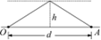
用 $$t_2$$ 表示爆炸声经云层反射到达 $$O$$ 处所经历的时间，因为反射角等于入射角，由几何关系得 $$2\sqrt{(\frac{d}{2})^2 + h^2} = vt_2$$；已知 $$t_2 - t_1 = \Delta t$$，联立解得 $$h = \frac{1}{2}\sqrt{(v\Delta t)^2 + 2dv\Delta t}$$，代入数值得 $$h = 2.0 \times 10^3\text{m}$$。

---
## ID：P-2026-01-1.1-023
**知识点**：#超声波测速,#声速,#位移,#速度
**难度**：0.3
**题型**：填空题
**题目描述**：(2001·上海·13)图甲是在高速公路上用超声波测速仪测量车速的示意图，测速仪发出并接收超声波脉冲信号，根据发出和接收到的信号间的时间差，测出被测物体的速度。图乙中 $$P_1$$、$$P_2$$ 是测速仪发出的超声波信号，$$N_1$$、$$N_2$$ 分别是 $$P_1$$、$$P_2$$ 由汽车反射回来的信号。设测速仪匀速扫描，$$P_1$$、$$P_2$$ 之间的时间间隔 $$\Delta t = 1.0\text{s}$$，超声波在空气中传播的速度是 $$v = 340\text{m/s}$$，若汽车是匀速行驶的，则根据图乙可知，汽车在接收到 $$P_1$$、$$P_2$$ 两个信号之间的时间内前进的距离是______m，汽车的速度是______m/s。
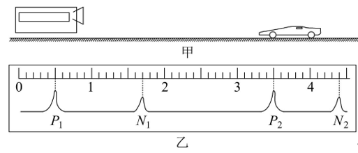
**答案**：17；17.9
**解析**：(1)作运动情景分析示意图，图中，$$P_1N_1$$ 中间时刻是汽车接收 $$P_1$$ 时刻发出的超声波信号的时刻，此位置 $$A$$ 是汽车的初位置；$$P_2N_2$$ 中间时刻是汽车接收 $$P_2$$ 时刻发出的超声波信号的时刻，此位置 $$B$$ 是汽车的末位置，要求的汽车前进的距离就是 $$A$$、$$B$$ 之间的距离。
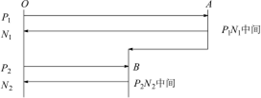
(2)求解：第1步，先读出图B中各时刻对应的读数；

第2步再算各点对应的时间，算法如下：先算每1大格对应的时间，$$t_1 = \frac{\Delta t}{P_2-P_1} = \frac{1.0}{3.5-0.5} = \frac{1}{3}$$，再算各点对应的时间；第3步，算出 $$A$$ 与 $$O$$ 的距离 $$s_1 = 340 \times (0.37 - 0.17)\text{m} = 68\text{m}$$；第4步，算出 $$B$$ 与 $$O$$ 的距离 $$s_2 = 340 \times (1.32 - 1.17)\text{m} = 51\text{m}$$；第5步，算出 $$A$$ 与 $$B$$ 的距离 $$\Delta s = s_1 - s_2 = 68\text{m} - 51\text{m} = 17\text{m}$$，这就是汽车在接收 $$P_1$$、$$P_2$$ 两个时刻发出的超声波信号间前进的距离；第6步，算出汽车从 $$A$$ 到 $$B$$ 用的时间为 $$\Delta t = 1.32\text{s} - 0.37\text{s} = 0.95\text{s}$$；第7步，算出汽车的速度为 $$v = \frac{\Delta s}{\Delta t} = \frac{17}{0.95} = 17.9\text{m/s} = 64\text{km/h}$$。

---
## ID：P-2026-01-1.1-024
**知识点**：#匀速运动,#几何关系,#角速度
**难度**：0.3
**题型**：解答题
**题目描述**：(2000·旧课程·19)一辆实验小车可沿水平地面(图中纸面)上的长直轨道匀速向右运动。有一台发出细光束的激光器装在小转台 $$M$$ 上，到轨道的距离 $$MN$$ 为 $$d = 10\text{m}$$，如图所示。转台匀速转动，使激光束在水平面内扫描，扫描一周的时间为 $$T = 60\text{s}$$，光束转动方向如图中箭头所示。当光束与 $$MN$$ 的夹角为45°时，光束正好射到小车上，如果再经过 $$\Delta t = 2.5\text{s}$$ 光束又射到小车上，则小车的速度为多少？(结果保留两位有效数字)
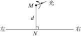
**答案**：1.7m/s 或 2.9m/s
**解析**：在 $$\Delta t$$ 内，光束转过角度 $$\Delta\varphi = \frac{\Delta t}{T} \times 360° = 15°$$，由题意知，**有两种可能**，如图所示。
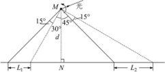
(1)光束照射小车时，小车正在接近 $$N$$ 点，$$\Delta t$$ 内光束与 $$MN$$ 的夹角从45°变为30°，小车走过 $$L_1$$，小车的速度为 $$v_1 = \frac{L_1}{\Delta t}$$，由几何关系知 $$L_1 = d(\tan45° - \tan30°)$$，联立并代入数值得 $$v_1 = 1.7\text{m/s}$$；(2)光束照到小车时，小车正在远离 $$N$$ 点，$$\Delta t$$ 内光束与 $$MN$$ 的夹角从45°变为60°，小车走过 $$L_2$$，小车的速度为 $$v_2 = \frac{L_2}{\Delta t}$$，由几何关系知 $$L_2 = d(\tan60° - \tan45°)$$，联立并代入数值得 $$v_2 = 2.9\text{m/s}$$。

---
## ID：P-2026-01-1.1-025
**知识点**：#匀加速直线运动,#匀速直线运动,#声速,#位移
**难度**：0.3
**题型**：解答题
**题目描述**：(2024·全国甲·24)为抢救病人，一辆救护车紧急出发，鸣着笛沿水平直路从 $$t = 0$$ 时由静止开始做匀加速运动，加速度大小 $$a = 2\text{m/s}^2$$，在 $$t_1 = 10\text{s}$$ 时停止加速开始做匀速运动，之后某时刻救护车停止鸣笛，$$t_2 = 41\text{s}$$ 时在救护车出发处的人听到救护车发出的最后的鸣笛声。已知声速 $$v_0 = 340\text{m/s}$$，求：(1)救护车匀速运动时的速度大小；(2)在停止鸣笛时救护车距出发处的距离。
**答案**：(1)20m/s；(2)680m
**解析**：(1)设救护车匀速运动时的速度为 $$v$$，$$0 \sim 10\text{s}$$ 内救护车做匀加速直线运动，由速度公式有 $$v = at_1$$，解得 $$v = 20\text{m/s}$$，所以救护车匀速运动时的速度为20m/s。(2)设救护车匀速行驶 $$t_3$$ 时间停止鸣笛，此时救护车距出发处的距离为 $$x$$，则由运动公式可知 $$x = \frac{1}{2}at_1^2 + vt_3$$，最后的鸣笛声传播过程中有 $$x = v_{\text{声}} \cdot (t_2 - t_3 - t_1)$$，联立两式解得 $$x = 680\text{m}$$。

---
## ID：P-2026-01-1.1-026
**知识点**：#匀变速直线运动,#速度,#位移,#加速度
**难度**：0.5
**题型**：多选题
**题目描述**：(1996·全国·9)一物体做匀变速直线运动，某时刻速度的大小为4m/s，1s后速度的大小变为10m/s。在这1s内该物体的
**选项**：
A. 位移的大小可能大于4m
B. 位移的大小可能小于10m
C. 加速度的大小可能大于4m/s²
D. 加速度的大小可能小于10m/s²
**答案**：AD
**解析**：物体做匀变速直线运动，有两种可能：1：若物体做匀加速直线运动，则 $$v_t=10\text{m/s}$$，位移 $$s=\frac{v_0+v_t}{2}t=7\text{m}$$，加速度 $$a=\frac{v_t-v_0}{t}=6\text{m/s}^2$$；2：若物体做匀减速直线运动，则 $$v_t=-10\text{m/s}$$，位移 $$s=\frac{v_0+v_t}{2}t=-3\text{m}$$，加速度 $$a=\frac{v_t-v_0}{t}=-14\text{m/s}^2$$，故AD正确。

---
## ID：P-2026-01-1.1-027
**知识点**：#瞬时速度,#平均速度,#光电门
**难度**：0.8
**题型**：单选题
**题目描述**：(2015·浙江·15)如图所示，气垫导轨上滑块经过光电门时，其上的遮光条将光遮住，电子计时器可自动记录遮光时间 $$\Delta t$$。测得遮光条的宽度为 $$\Delta x$$，用 $$\frac{\Delta x}{\Delta t}$$ 近似代表滑块通过光电门时的瞬时速度。为使 $$\frac{\Delta x}{\Delta t}$$ 更接近瞬时速度，正确的措施是
**选项**：
A. 换用宽度更窄的遮光条
B. 提高测量遮光条宽度的精确度
C. 使滑块的释放点更靠近光电门
D. 增大气垫导轨与水平面的夹角
**答案**：A
**解析**：由 $$v = \frac{\Delta x}{\Delta t}$$ 可知遮光片的宽度越窄，滑块通过光电门的平均速度越接近小车的瞬时速度，故A正确。

---
## ID：P-2026-01-1.1-028
**知识点**：#瞬时速度,#估算,#曝光时间
**难度**：0.5
**题型**：单选题
**题目描述**：(2007·北京·18)图示为高速摄影机拍摄到的子弹穿透苹果瞬间的照片。该照片经过放大后分析出，在曝光时间内，子弹影像前后错开的距离约为子弹长度的1%~2%。已知子弹飞行速度约为500m/s，由此可估算出这幅照片的曝光时间最接近
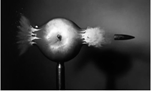
**选项**：
A. $$10^{-3}$$s
B. $$10^{-6}$$s
C. $$10^{-9}$$s
D. $$10^{-12}$$s
**答案**：B
**解析**：子弹影像前后错开的距离为子弹长度 $$l$$ 的1%~2%，而子弹长度在cm级，则曝光时间约为 $$t = \frac{1\times1\%\times10^{-2}}{500}\text{s} = 2 \times 10^{-7}\text{s}$$，B项最接近，故B正确。

---
## ID：P-2026-01-1.1-029
**知识点**：#匀变速直线运动,#平均速度,#位移,#时间
**难度**：0.7
**题型**：单选题
**题目描述**：(2015·浙江10月·6)如图所示，一女同学穿着轮滑鞋以一定的速度俯身"滑入"静止汽车的车底，她用15s穿越了20辆汽车底部后"滑出"，位移为58m。假设她的运动可视为匀变速直线运动，从上述数据可以确定
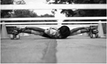
**选项**：
A. 她在车底运动时的加速度
B. 她在车底运动时的平均速度
C. 她刚"滑入"车底时的速度
D. 她刚"滑出"车底时的速度
**答案**：B
**解析**：由题意知，该同学运动的位移和时间已知，能通过计算确定其平均速度，故B正确；由于初速度未知，其他选项的物理量无法确定，故ACD错误。

---
## ID：P-2026-01-1.1-030
**知识点**：#匀减速直线运动,#制动距离,#位移
**难度**：0.9
**题型**：单选题
**题目描述**：(2024·北京·2)一辆汽车以10m/s的速度匀速行驶，制动后做匀减速直线运动，经2s停止，汽车的制动距离为
**选项**：
A. 5m
B. 10m
C. 20m
D. 30m
**答案**：B
**解析**：汽车做末速度为零的匀减速直线运动，则有 $$x = \frac{v_0+v}{2}t = 10\text{m}$$，B正确，ACD错误。

---
## ID：P-2026-01-1.1-031
**知识点**：#匀加速直线运动,#位移,#时间
**难度**：0.9
**题型**：单选题
**题目描述**：(2006·四川·14)2006年我国自行研制的"枭龙"战机04架在四川某地试飞成功。假设该战机起飞前从静止开始做匀加速直线运动，达到起飞速度 $$v$$ 所需时间为 $$t$$，则起飞前的运动距离为
**选项**：
A. $$vt$$
B. $$\frac{vt}{2}$$
C. $$2vt$$
D. 不能确定
**答案**：B
**解析**：战机运动的平均速度为 $$\bar{v} = \frac{v}{2}$$，得 $$s = \bar{v}t = \frac{v}{2}t$$，故B正确。

---
## ID：P-2026-01-1.1-032
**知识点**：#匀加速直线运动,#加速度,#平均速度
**难度**：0.5
**题型**：单选题
**题目描述**：(2011·安徽·16)一物体做匀加速直线运动，通过一段位移 $$\Delta x$$ 所用的时间为 $$t_1$$，紧接着通过下一段位移 $$\Delta x$$ 所用时间为 $$t_2$$。则物体运动的加速度为
**选项**：
A. $$\frac{2\Delta x(t_1-t_2)}{t_1t_2(t_1+t_2)}$$
B. $$\frac{\Delta x(t_1-t_2)}{t_1t_2(t_1+t_2)}$$
C. $$\frac{2\Delta x(t_1+t_2)}{t_1t_2(t_1-t_2)}$$
D. $$\frac{\Delta x(t_1+t_2)}{t_1t_2(t_1-t_2)}$$
**答案**：A
**解析**：物体做匀加速直线运动，匀变速直线运动中间时刻的瞬时速度等于该段的平均速度，即 $$v_1 = \frac{\Delta x}{t_1}$$，$$v_2 = \frac{\Delta x}{t_2}$$，由加速度的定义式得 $$a = \frac{v_2-v_1}{\frac{t_1}{2}+\frac{t_2}{2}} = \frac{2\Delta x(t_1-t_2)}{t_1t_2(t_1+t_2)}$$，故A正确。

---
## ID：P-2026-01-1.1-033
**知识点**：#匀加速直线运动,#平均速度,#加速度
**难度**：0.6
**题型**：单选题
**题目描述**：(2016·上海·14)物体做匀加速直线运动，相继经过两端距离均为16m的路程，第一段用时4s，第二段用时2s，则物体的加速度是
**选项**：
A. $$\frac{2}{3}m/s^2$$
B. $$\frac{4}{3}m/s^2$$
C. $$\frac{8}{9}m/s^2$$
D. $$\frac{16}{9}m/s^2$$
**答案**：B
**解析**：由中间时刻的瞬时速度等于这段时间的平均速度。第一段距离中间时刻的速度 $$v_2 = 4m/s$$，第二段距离中间时刻的速度 $$v_5 = 8m/s$$。由 $$a = \frac{v_5-v_2}{t} = \frac{4}{3}m/s^2$$，故B正确。

---
## ID：P-2026-01-1.1-034
**知识点**：#匀减速直线运动,#平均速度,#瞬时速度
**难度**：0.4
**题型**：单选题
**题目描述**：(2023·山东·6)如图所示，电动公交车做匀减速直线运动进站，连续经过R、S、T三点，已知ST间的距离是RS的两倍，RS段的平均速度是10m/s，ST段的平均速度是5m/s，则公交车经过T点时的瞬时速度为
**选项**：
A. 3m/s
B. 2m/s
C. 1m/s
D. 0.5m/s
**答案**：C
**解析**：公交车做匀减速直线运动，设在RS段运动的时间 $$t_1$$，在ST段运动的时间 $$t_2$$，根据 $$t = \frac{x}{v}$$，可得 $$t_1 : t_2 = 1 : 4$$，可令 $$t_1 = 2t$$，$$t_2 = 8t$$，取公交车经过R的时刻为时刻0，经过T的速度为 $$v_0$$，根据匀变速直线运动规律，一段时间内的平均速度等于这段时间内中间时刻的瞬时速度，可得 $$v_t = 10m/s$$，$$v_{6t} = 5m/s$$，又 $$v_t - at = v_0$$，$$v_{6t} - 4at = v_0$$，联立解得 $$v_0 = 1m/s$$，C正确。

---
## ID：P-2026-01-1.1-035
**知识点**：#匀加速直线运动,#加速度,#平均速率
**难度**：0.5
**题型**：填空题
**题目描述**：(2014·上海·23)如图所示，两光滑斜面在B处连接，小球由A处静止释放，经过B、C两点时速度大小分别为3m/s和4m/s，$$AB = BC$$。设球经过B点前后速度大小不变，则球在AB、BC段的加速度大小之比为______，球由A运动到C的过程中平均速率为______m/s。
**答案**：9:7；2.1
**解析**：设 $$AB = BC = s$$，对小球在A、B间和B、C间的运动，由运动学公式得 $$v_B^2 = 2a_1s$$ 和 $$v_C^2 - v_B^2 = 2a_2s$$，解得 $$\frac{a_1}{a_2} = \frac{9}{7}$$；由 $$s = \frac{v_B}{2}t_1$$、$$s = \frac{v_B+v_C}{2}t_2$$、$$v = \frac{2s}{t_1+t_2}$$，解得 $$v = 2.1m/s$$。

---
## ID：P-2026-01-1.1-036
**知识点**：#匀加速直线运动,#动能,#加速度,#位移
**难度**：0.6
**题型**：单选题
**题目描述**：(2016·新课标III·16)一质点做速度逐渐增大的匀加速直线运动，在时间间隔 $$t$$ 内位移为 $$s$$，动能变为原来的9倍。该质点的加速度为
**选项**：
A. $$\frac{s}{t^2}$$
B. $$\frac{3s}{2t^2}$$
C. $$\frac{4s}{t^2}$$
D. $$\frac{8s}{t^2}$$
**答案**：A
**解析**：设质点的初速度为 $$v_0$$，末速度为 $$v_t$$，加速度为 $$a$$，位移 $$s = vt = \frac{1}{2}(v_0 + v_t)t$$，初动能为 $$\frac{1}{2}mv_0^2$$，末动能为 $$\frac{1}{2}mv_t^2$$，由于末动能是初动能的9倍，故 $$\frac{\frac{1}{2}mv_t^2}{\frac{1}{2}mv_0^2} = 9$$，联立解得 $$v_0 = \frac{s}{2t}$$，$$v = \frac{3s}{2t}$$，又 $$a = \frac{v_t-v_0}{t} = \frac{\frac{3s}{2t}-\frac{s}{2t}}{t} = \frac{s}{t^2}$$，故A正确。

---
## ID：P-2026-01-1.1-037
**知识点**：#匀加速直线运动,#加速度,#位移
**难度**：0.4
**题型**：解答题
**题目描述**：(2014·海南·13)短跑运动员完成100m赛跑的过程简化为匀加速运动和匀速运动两个阶段。一次比赛中，某运动员用11.00s跑完全程。已知运动员在加速阶段的第2s内通过的距离为7.5m，求该运动员的加速度及在加速阶段通过的距离。
**答案**：10m
**解析**：由题意，在第1s和第2s内运动员都做匀加速运动。设运动员在匀加速阶段的加速度为 $$a$$，在第1s和第2s内通过的位移分别为 $$s_1$$ 和 $$s_2$$，由运动学规律得 $$s_1 = \frac{1}{2}at_0^2$$，$$s_1 + s_2 = \frac{1}{2}a(2t_0)^2$$，式中 $$t_0 = 1s$$，联立并代入已知条件，得 $$a = 5m/s^2$$。设运动员做匀加速运动的时间为 $$t_1$$，匀速运动的时间为 $$t_2$$，匀速运动的速度为 $$v$$；跑完全程的时间为 $$t$$，全程的距离为 $$s$$，依题意及运动学规律得 $$t = t_1 + t_2$$，$$v = at_1$$，$$s = \frac{1}{2}at_1^2 + vt_2$$。设加速阶段通过的距离为 $$s'$$，则 $$s' = \frac{1}{2}at_1^2$$，联立并代入数据得 $$s' = 10m$$。

---
## ID：P-2026-01-1.1-038
**知识点**：#匀减速直线运动,#加速度,#位移
**难度**：0.5
**题型**：解答题
**题目描述**：(2024·广西·13)如图，轮滑训练场沿直线等间距地摆放着若干个定位锥筒，锥筒间距 $$d = 0.9m$$，某同学穿着轮滑鞋向右匀减速滑行。现测出他从1号锥筒运动到2号锥筒用时 $$t_1 = 0.4s$$，从2号锥筒运动到3号锥筒用时 $$t_2 = 0.5s$$。求该同学：(1)滑行的加速度大小；(2)最远能经过几号锥筒。
**答案**：(1)$$1m/s^2$$；(2)最远能经过4号锥筒
**解析**：(1)设该同学滑行的初速度为 $$v$$，滑行的加速度大小为 $$a$$，则从1号锥筒到2号锥筒由匀变速直线运动位移-时间关系可得 $$d = vt_1 - \frac{1}{2}at_1^2$$，同理，1号锥筒到3号锥筒可得 $$2d = v(t_1 + t_2) - \frac{1}{2}a(t_1 + t_2)^2$$，联立解得 $$a = 1m/s^2$$，$$v = 2.45m/s$$。(2)设该同学停下来时的位移为 $$x$$，由匀变速直线运动速度-位移关系可得 $$0 - v^2 = -2ax$$，解得 $$x = 3.00125m$$，则 $$n = \frac{x}{d} \approx 3.3$$，所以最远能经过4号锥筒。

---
## ID：P-2026-01-1.1-039
**知识点**：#速度,#位移,#位置坐标
**难度**：0.8
**题型**：单选题
**题目描述**：(2024·江西·3)一质点沿 $$x$$ 轴运动，其位置坐标 $$x$$ 与时间 $$t$$ 的关系为 $$x = 1 + 2t + 3t^2$$（$$x$$ 的单位是m，$$t$$ 的单位是s）。关于速度及该质点在第1s内的位移，下列选项正确的是
**选项**：
A. 速度是对物体位置变化快慢的描述；6m
B. 速度是对物体位移变化快慢的描述；6m
C. 速度是对物体位置变化快慢的描述；5m
D. 速度是对物体位移变化快慢的描述；5m
**答案**：C
**解析**：速度是对物体位置变化快慢的描述，BD错误；根据题中 $$x$$ 与 $$t$$ 的关系可知，$$t = 0$$ 时，质点位于 $$x_0 = 1m$$ 处，$$t = 1s$$ 时，质点位于 $$x_1 = 6m$$ 处，因此质点在第1s内的位移为5m，A错误，C正确。

---
## ID：P-2026-01-1.1-040
**知识点**：#位移,#平均速度,#加速度,#匀变速直线运动
**难度**：0.6
**题型**：单选题
**题目描述**：(2011·天津·3)质点做直线运动的位移 $$x$$ 与时间 $$t$$ 的关系为 $$x = 5t + t^2$$（各物理量均采用国际单位制单位），则该质点
**选项**：
A. 第1s内的位移是5m
B. 前2s内的平均速度是6m/s
C. 任意相邻的1s内位移差都是1m
D. 任意1s内的速度增量都是2m/s
**答案**：D
**解析**：当 $$t = 1s$$ 时，第1s内的位移 $$x = (5 \times 1 + 1^2)m = 6m$$，故A错误；前2s的平均速度 $$\bar{v} = \frac{x}{t} = \frac{5 \times 2 + 2^2}{2}m/s = 7m/s$$，故B错误；由匀变速直线运动位移公式 $$x = v_0t + \frac{1}{2}at^2$$ 结合 $$x = 5t + t^2$$ 得 $$v_0 = 5m/s$$，$$a = 2m/s^2$$，那么任意相邻1s内的位移差均为 $$\Delta x = aT^2 = 2 \times 1^2m = 2m$$，故C错误；因 $$a = \frac{\Delta v}{\Delta t}$$ 任意1s内的速度增量 $$\Delta v = a\Delta t = 2 \times 1m/s = 2m/s$$，故D正确。

---
## ID：P-2026-01-1.1-041
**知识点**：#匀加速直线运动,#速度,#位移,#加速度
**难度**：0.8
**题型**：单选题
**题目描述**：(2013·广东·13)某航母跑道长200m，飞机在航母上滑行的最大加速度为 $$6m/s^2$$，起飞需要的最低速度为50m/s。那么，飞机在滑行前，需要借助弹射系统获得的最小初速度为
**选项**：
A. 5m/s
B. 10m/s
C. 15m/s
D. 20m/s
**答案**：B
**解析**：由运动学方程可得 $$v^2 - v_0^2 = 2ax$$，飞机需要借助弹射系统获得的最小初速度为 $$v_0 = 10m/s$$，故B正确。

---
## ID：P-2026-01-1.1-042
**知识点**：#匀减速直线运动,#速度,#位移,#加速度
**难度**：0.9
**题型**：单选题
**题目描述**：(2019·海南·3)汽车在平直公路上以20m/s的速度匀速行驶。前方突遇险情，司机紧急刹车，汽车做匀减速运动，加速度大小为 $$8m/s^2$$。从开始刹车到汽车停止，汽车运动的距离为
**选项**：
A. 10m
B. 20m
C. 25m
D. 50m
**答案**：C
**解析**：由题意可知，刹车时汽车的初速度 $$v_0 = 20m/s$$，末速度 $$v = 0$$，加速度 $$a = -8m/s^2$$，由速度位移公式得，$$v^2 - v_0^2 = 2ax$$，解得 $$x = 25m$$，故C正确。

---
## ID：P-2026-01-1.1-043
**知识点**：#匀加速直线运动,#匀速运动,#位移,#时间
**难度**：0.5
**题型**：单选题
**题目描述**：(2015·江苏·5)如图所示，某"闯关游戏"的笔直通道上每隔8m设有一个关卡，各关卡同步放行和关闭，放行和关闭的时间分别为5s和2s。关卡刚放行时，一同学立即在关卡1处以加速度 $$2m/s^2$$ 由静止加速到2m/s，然后匀速向前，则最先挡住他前进的关卡是
**选项**：
A. 关卡2
B. 关卡3
C. 关卡4
D. 关卡5
**答案**：C
**解析**：关卡第一次关闭时 $$t_1 = 5s$$，该同学通过的位移 $$x_1 = \frac{v^2}{2a} + v(t_1 - \frac{v}{a}) = 9m$$，那么关卡第一次关闭时该同学穿过关卡2，并且离关卡2的距离为1m，关闭的2s内该同学在关卡2、3之间继续前行 $$x_2 = vt_2 = 4m$$，则关卡第二次放行的5s内的位移 $$x_3 = vt_3 = 10m$$，那么第二次关闭时该同学离出发点的距离为23m，故关卡4将挡住该同学前进，故C正确。

---
## ID：P-2026-01-1.1-044
**知识点**：#匀加速直线运动,#匀减速直线运动,#位移,#时间
**难度**：0.4
**题型**：多选题
**题目描述**：(2009·江苏·7)如图所示，以8m/s匀速行驶的汽车即将通过路口，绿灯还有2s将熄灭，此时汽车距离停车线18m。该车加速时最大加速度大小为 $$2m/s^2$$，减速时最大加速度大小为 $$5m/s^2$$。此路段允许行驶的最大速度为12.5m/s，下列说法中正确的有
**选项**：
A. 如果立即做匀加速运动，在绿灯熄灭前汽车刚好能通过停车线
B. 如果立即做匀加速运动，在绿灯熄灭前通过停车线汽车一定超速
C. 如果立即做匀减速运动，在绿灯熄灭前汽车一定不能通过停车线
D. 如果距停车线5m处减速，汽车能停在停车线处
**答案**：AC
**解析**：如果汽车立即做匀加速运动，在2s内对应的末速度为12m/s，对应的位移为 $$x = \frac{8+12}{2} \times 2m = 20m$$，故A正确B错误；如果汽车立即做匀减速运动，汽车在 $$\frac{8}{5}s$$ 已经静止，对应位移为6.4m，故C正确D错误。

---
## ID：P-2026-01-1.1-045
**知识点**：#匀加速直线运动,#速度,#位移,#时间
**难度**：0.4
**题型**：解答题
**题目描述**：(2008·全国I·23)已知O、A、B、C为同一直线上的四点，AB间的距离为 $$l_1$$，BC间的距离为 $$l_2$$，一物体自O点静止出发，沿此直线做匀加速运动，依次经过A、B、C三点，已知物体通过AB段与通过BC段所用时间相等。求O与A的距离。
**答案**：$$\frac{(3l_1-l_2)^2}{8(l_2-l_1)}$$
**解析**：设物体的加速度为 $$a$$，到达A的速度为 $$v_0$$，通过AB段和BC段所用的时间为 $$t$$，由运动学公式得 $$l_1 = v_0t + \frac{1}{2}at^2$$，$$l_1 + l_2 = 2v_0t + 2at^2$$，联立化简得 $$l_2 - l_1 = at^2$$，又 $$3l_1 - l_2 = 2v_0t$$，设O与A的距离为 $$l$$，则有 $$l = \frac{v_0^2}{2a}$$，联立解得 $$l = \frac{(3l_1-l_2)^2}{8(l_2-l_1)}$$。

---
## ID：P-2026-01-1.1-046
**知识点**：#匀加速直线运动,#加速度变化,#位移
**难度**：0.5
**题型**：解答题
**题目描述**：(2011·新课标·24)甲、乙两辆汽车都从静止出发做加速直线运动，加速度方向一直不变。在第一段时间间隔内，两辆汽车的加速度大小不变，汽车乙的加速度大小是甲的两倍；在接下来的相同时间间隔内，汽车甲的加速度大小增加为原来的两倍，汽车乙的加速度大小减小为原来的一半。求甲、乙两车各自在这两段时间间隔内走过的总路程之比。
**答案**：$$\frac{5}{7}$$
**解析**：设汽车甲在第一段时间间隔末（时刻 $$t_0$$）的速度为 $$v$$，第一段时间间隔内行驶的路程为 $$s_1$$，加速度为 $$a$$；在第二段时间间隔内行驶的路程为 $$s_2$$，由运动学公式得 $$v = at_0$$，$$s_1 = \frac{1}{2}at_0^2$$，$$s_2 = vt_0 + \frac{1}{2}(2a)t_0^2$$。设汽车乙在时刻 $$t_0$$ 的速度为 $$v'$$，在第一、二段时间间隔内行驶的路程分别为 $$s_1'$$，$$s_2'$$，同样有 $$v' = (2a)t_0$$，$$s_1' = \frac{1}{2}(2a)t_0^2$$，$$s_2' = v't_0 + \frac{1}{2}at_0^2$$。设甲、乙两车行驶的总路程分别为 $$s$$，$$s'$$，则有 $$s = s_1 + s_2$$，$$s' = s_1' + s_2'$$，联立以上各式解得，甲、乙两车各自行驶的总路程之比 $$\frac{s}{s'} = \frac{5}{7}$$。

---
## ID：P-2026-01-1.1-047
**知识点**：#匀加速直线运动,#加速度,#竖直上抛,#能量
**难度**：0.5
**题型**：解答题
**题目描述**：(2005·全国I·23)原地起跳时，先屈腿下蹲，然后突然蹬地。从开始蹬地到离地是加速过程（视为匀加速），加速过程中重心上升的距离称为"加速距离"。离地后重心继续上升，在此过程中重心上升的最大距离称为"竖直高度"。现有下列数据：人原地上跳的"加速距离" $$d_1 = 0.50m$$，"竖直高度" $$h_1 = 1.0m$$；跳蚤原地上跳的"加速距离" $$d_2 = 0.00080m$$，"竖直高度" $$h_2 = 0.10m$$。假想人具有与跳蚤相等的起跳加速度，而"加速距离"仍为0.50m，则人上跳的"竖直高度"是多少？（$$g$$ 取 $$10m/s^2$$）
**答案**：62.50m
**解析**：用 $$a$$ 表示跳蚤起跳的加速度，$$v$$ 表示离地时的速度，则对加速过程和离地后上升过程，分别有 $$v^2 = 2ad_2$$，$$v^2 = 2gh_2$$。若假想人具有和跳蚤相同的加速度 $$a$$，令 $$V$$ 表示在这种假想下人离地时的速度，$$H$$ 表示与此相应的竖直高度，则对加速过程和离地后上升过程，分别有 $$V^2 = 2ad_1$$，$$V^2 = 2gH$$，联立解得 $$H = \frac{h_2d_1}{d_2}$$，代入数值解得 $$H = 62.50m$$。

---
## ID：P-2026-01-1.1-048
**知识点**：#匀加速直线运动,#匀速运动,#速度,#位移,#时间
**难度**：0.4
**题型**：解答题
**题目描述**：(2010·新课标·24)短跑名将博尔特在北京奥运会上创造了100m和200m短跑项目的新世界纪录，他的成绩分别是9.69s和19.30s。假定他在100m比赛时从发令到起跑的反应时间是0.15s，起跑后做匀加速运动，达到最大速率后做匀速运动。200m比赛时，反应时间及起跑后加速阶段的加速度和加速时间与100m比赛时相同，但由于弯道和体力等因素的影响，以后的平均速率只有跑100m时最大速率的96%。求：(1)加速所用时间和达到的最大速率；(2)起跑后做匀加速运动的加速度。（结果保留两位小数）
**答案**：(1)1.29s；11.24m/s；(2)$$8.71m/s^2$$
**解析**：(1)设加速所用时间为 $$t$$（以s为单位），匀速运动的速度为 $$v$$（以m/s为单位），则有 $$\frac{1}{2}vt + (9.69 - 0.15 - t)v = 100$$，$$\frac{1}{2}vt + (19.30 - 0.15 - t) \times 0.96v = 200$$，联立解得 $$t = 1.29s$$，$$v = 11.24m/s$$。(2)设加速度大小为 $$a$$，则 $$a = \frac{v}{t} = 8.71m/s^2$$。

---
## ID：P-2026-01-1.1-049
**知识点**：#匀加速直线运动,#匀减速直线运动,#位移,#速度,#时间
**难度**：0.3
**题型**：解答题
**题目描述**：(2006·上海·20)辨析题：要求摩托车由静止开始在尽可能短的时间内走完一段直道，然后驶入一段半圆形的弯道，但在弯道上行驶时车速不能太快，以免因离心作用而偏出车道。求摩托车在直道上行驶所用的最短时间。有关数据见表格。某同学是这样解的：要使摩托车所用时间最短，应先由静止加速到最大速度 $$v_1 = 40m/s$$，然后再减速到 $$v_2 = 20m/s$$，$$t_1 = \frac{v_1}{a_1} = \cdots$$，$$t_2 = \frac{v_1-v_2}{a_2} = \cdots$$，$$t = t_1 + t_2 = \cdots$$。你认为这位同学的解法是否合理？若合理，请完成计算；若不合理，请说明理由，并用你自己的方法算出正确结果。
**答案**：不正确；11s
**解析**：该同学的解法不正确，因为摩托车需在218m的直道上完成变速运动过程，但照该同学的解法，有 $$t_1 = \frac{v_1}{a_1} = \frac{40}{4} = 10s$$，$$t_2 = \frac{v_1-v_2}{a_2} = \frac{40-20}{8} = 2.5s$$，则 $$t = t_1 + t_2 = 12.5s$$，摩托车的位移为 $$s = s_1 + s_2 = \frac{1}{2}v_1t_1 + \frac{1}{2}(v_1 + v_2)t_2 = 275m$$，已大于直道长度218m。正确的解法如下：摩托车在 $$t_1$$ 时间内加速到 $$v_m$$，再在 $$t_2$$ 时间内减速到 $$v_2$$，总位移 $$s$$ 为218m，由运动学公式得 $$t_1 = \frac{v_m}{a_1}$$，$$t_2 = \frac{v_m-v_2}{a_2}$$，摩托车的位移为 $$\frac{v_m}{2}t_1 + \frac{v_m+v_2}{2}t_2 = s$$，联立解得 $$v_m = 36m/s$$，最短时间 $$t = t_1 + t_2 = \frac{v_m}{a_1} + \frac{v_m-v_2}{a_2} = \frac{36}{4} + \frac{36-20}{8} = 11s$$。

---
