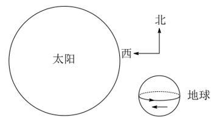
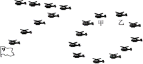
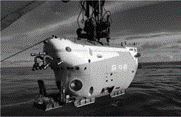
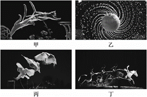
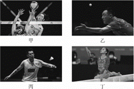
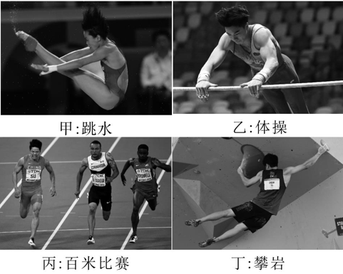
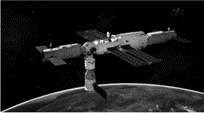

---
## ID：P-2026-01-1.1-001
**知识点**：#地球自转,#物理模型的构建
**难度**：0.4
**题型**：单选题
**题目描述**：太阳从东边升起，西边落下，是地球上的自然现象，但在某些条件下，在纬度较高地区上空飞行的飞机上，旅客可以看到太阳从西边升起的奇妙现象，这些条件是
**选项**：
 A. 时间必须是在清晨，飞机正在由东向西飞行，飞机的速度必须较大
 B. 时间必须是在清晨，飞机正在由西向东飞行，飞机的速度必须较大
 C. 时间必须是在傍晚，飞机正在由东向西飞行，飞机的速度必须较大
 D. 时间必须是在傍晚，飞机正在由西向东飞行，飞机的速度不能太大
**答案**：C
**解析**：如果是在傍晚，飞机正在由东向西飞行，飞机的速度大于当地纬度较高地区地球自转的线速度，则地球表面的人看到太阳从西方落下来，飞机上的旅客可以看到太阳从西边升起，如图所示

---
## ID：P-2026-01-1.1-002
**知识点**：#质点模型,#参考系
**难度**：0.9
**题型**：单选题
**题目描述**：2015年9月3日，纪念中国人民抗日战争暨世界反法西斯战争胜利70周年阅兵式在天安门广场举行.如图所示，七架战机保持“固定队列”在天安门广场上空飞过.下列说法正确的是

**选项**：
 A. 以某飞机为参考系，其他飞机是静止的
 B. 以飞行员为参考系，广场上的观众是静止的
 C. 以某飞行员为参考系，其他飞行员是运动的
 D. 以广场上的观众为参考系，飞机是竖直向上运动的
**答案**：A
**解析**：七架战机保持“固定队列”飞行，所以以某飞机为参考系，其它飞机是静止的，故A正确；以飞行员为参考系，飞行员看到观礼台向后掠过，故B错误；六机低空拉烟通场表演，以非常一致的飞行姿态通过观礼台，飞机编队保持队形不变，所以以某飞行员为参考系，其他飞行员是静止的，故C错误；以广场上的观众为参考系，飞机是在水平方向上运动的，故D错误.

---
## ID：P-2026-01-1.1-003
**知识点**：#参考系
**难度**：0.9
**题型**：单选题
**题目描述**：如图所示，新中国成立70周年阅兵仪式上，国产武装直升机排列并保持“70”字样编队从天安门上空整齐飞过.甲、乙分别是编队中的两架直升机，则

**选项**：
A. 以甲为参考系，乙是运动的
B. 以乙为参考系，甲是运动的
C. 以甲为参考系，坐在观众席上的观众都是静止的
D. 以乙为参考系，“70”字样编队中所有直升机都是静止的
**答案**：D
**解析**：直升机编队保持“70”字样飞行，则以甲为参考系，甲、乙间没有位置的改变，故乙是相对静止的，同理以乙为参考系，甲是静止的，故AB错误；以甲为参考系，坐在观众席上的观众都是运动的，故C错误；以乙为参考系，“70”字样编队中所有直升机都是静止的，故D正确.

---
## ID：P-2026-01-1.1-004
**知识点**：#质点
**难度**：0.9
**题型**：单选题
**题目描述**：2020年11月10日，我国“奋斗者”号载人潜水器在马里亚纳海沟成功坐底，坐底深度10909m.“奋斗者”号照片如图所示，下列情况中“奋斗者”号一定可视为质点的是

**选项**：
A. 估算下降总时间时
B. 用推进器使其转弯时
C. 在海沟中穿越窄缝时
D. 科学家在其舱内进行实验时
**答案**：A
**解析**：估算“奋斗者”号下降总时间时，其大小、形状可以忽略不计，可视为质点，故A正确；用推进器使其转弯时、在海沟中穿越窄缝时、科学家在其舱内进行实验时，其大小、形状不能忽略，故不可视为质点，故BCD错误.

---
## ID：P-2026-01-1.1-005
**知识点**：#质点
**难度**：0.9
**题型**：单选题
**题目描述**：用高速摄影机拍摄的四张照片如图所示，下列说法正确的是

**选项**：
A. 研究甲图中猫在地板上行走的速度时，猫可视为质点
B. 研究乙图中水珠形状形成的原因时，旋转球可视为质点
C. 研究丙图中飞翔鸟儿能否停在树桩上时，鸟儿可视为质点
D. 研究丁图中马术运动员和马能否跨越障碍物时，马可视为质点
**答案**：A
**解析**：研究猫在地板上行走的速度时，猫的大小与形状可以忽略，所以猫可以看作质点，故A正确；研究水珠形状形成的原因时，旋转球的大小与形状不能忽略，所以旋转球不能看作质点，故B错误；研究飞翔的鸟儿能否停在树桩上时，鸟儿的大小和形状不能忽略，所以飞翔的鸟儿不能看作质点，故C错误；研究马术运动员和马能否跨越障碍物时，要考虑动作细节，马的大小与形状不能忽略，所以马不能看作质点，故D错误.

---
## ID：P-2026-01-1.1-006
**知识点**：#质点
**难度**：0.9
**题型**：单选题
**题目描述**：
**选项**：
 A. 研究甲图中排球运动员扣球动作时，排球可以看成质点
 B. 研究乙图中乒乓球运动员的发球技术时，乒乓球不能看成质点
 C. 研究丙图中羽毛球运动员回击羽毛球动作时，羽毛球大小可以忽略
 D. 研究丁图中体操运动员的平衡木动作时，运动员身体各部分的速度可视为相同
**答案**：B
**解析**：研究题图甲中排球运动员扣球动作时,需要考虑运动员扣球的位置,故排球不可以看成质点,故A错误;研究题图乙中乒乓球运动员的发球技术时,需要考虑球是否旋转,则乒乓球不能看成质点,故B正确;研究题图丙中羽毛球运动员回击羽毛球动作时,需要考虑球拍击球的具体位置,则羽毛球大小不可以忽略,故C错误;研究题图丁中体操运动员的平衡木动作时,运动员身体各部分有相对运动,则运动员身体各部分的速度不相同,故D错误.

---
## ID：P-2026-01-1.1-007
**知识点**：#质点
**难度**：0.9
**题型**：单选题
**题目描述**：杭州亚运会顺利举行,如图所示为运动会中的四个比赛场景.在下列研究中可将运动员视为质点的是

**选项**：
A. 研究甲图运动员的入水动作
B. 研究乙图运动员的空中转体姿态
C. 研究丙图运动员在百米比赛中的平均速度
D. 研究丁图运动员通过某个攀岩支点的动作
**答案**：C
**解析**：质点是理想模型,现实中不存在,当研究对象的形状和大小对研究问题不影响或影响很小可忽略时,在该研究问题中的研究对象可被看成质点,故C正确,ABD错误.

---
## ID：P-2026-01-1.1-008
**知识点**：#质点
**难度**：0.9
**题型**：单选题
**题目描述**：
“神舟十五号”飞船和空间站“天和”核心舱成功对接后，在轨运行如图所示，则
**选项**：
A. 选地球为参考系，“天和”是静止的
B. 选地球为参考系，“神舟十五号”是静止的
C. 选“天和”为参考系，“神舟十五号”是静止的
D. 选“神舟十五号”为参考系，“天和”是运动的
**答案**：C
**解析**："神舟十五号"飞船和空间站"天和"核心舱对接后环绕地球做匀速圆周运动，因此以地球为参考系，"神舟十五号"和"天和"均是运动的，AB错误;选"天和"为参考系，"神舟十五号"是静止的，C正确;选"神舟十五号"为参考系，"天和"是静止的，D错误.

---
## ID：P-2026-01-1.1-009
**知识点**：#路程,#位移,#时间,#时刻
**难度**：0.9
**题型**：单选题
**题目描述**：(2016·浙江4月·1)某同学绕操场一周跑了400m，用时65s。这两个物理量分别是
**选项**：
A. 路程、时刻
B. 位移、时刻
C. 路程、时间
D. 位移、时间
**答案**：C
**解析**：绕400米操场跑一圈，首末位置重合，则位移的大小为0，路程等于400m。65s指时间长度，是指时间，故C正确。

---
